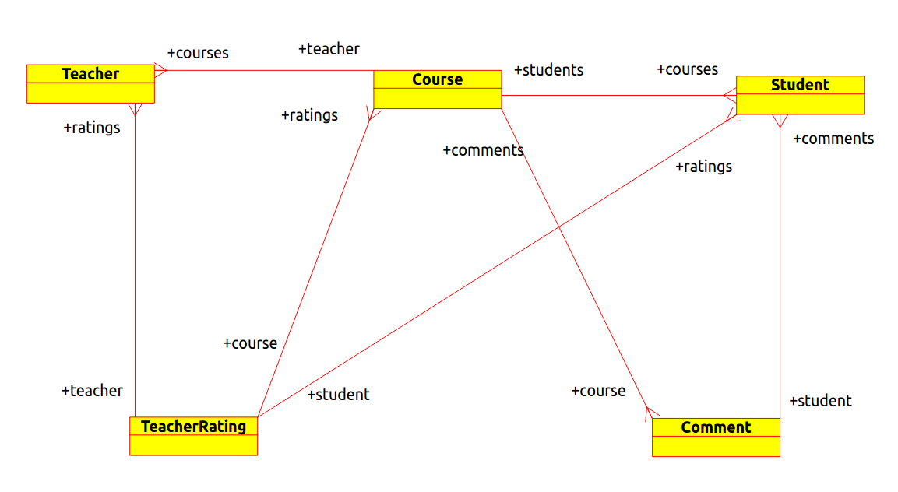
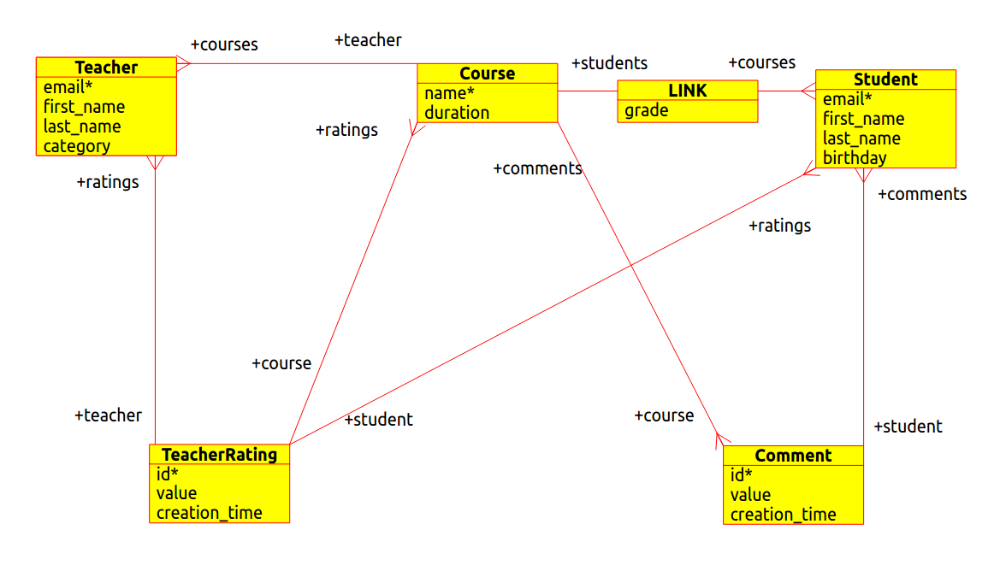

> Tutorial <
============

The aim of this tutorial is to provide a comprehensive overview of Resource API components and how they are supposed to
be used to implement real-life applications.

.. note::

    Some of the sections and examples of this tutorial intersect with the information provided by the actual code
    documentation. This *is* intentional.

Intro
-----

For the sake of this tutorial lets try to design a simple school course management system backed with a primitive
python `shelve <https://docs.python.org/2/library/shelve.html>`_ backend that is reasonable to use during prototype
phase. We shall implement a granular authorization using means of Resource API framework. After the implementation
is done we shall play with direct Python API and HTTP interface.

1: collect the use cases
------------------------

Our course simple management system must be able to support the following actions:

 - students can sign up to courses
 - teachers can kick the students out from the courses
 - teachers can grade the students during the courses
 - students can make comments about the course and rate its teacher respectively
 - teachers are supposed to have information like qualification, diploma, etc.

2: determine entities
---------------------

Based on usecases mentioned above we can list the following entities (in singular):

 - student
 - teacher
 - course
 - comment
 - student grade
 - teacher rating

Also the following links are supposed to exist:

 - student can sign up for MANY courses and each course can be attended by MANY students
 - teacher can teach MULTIPLE courses but each course can be taught only by a SINGLE teacher
 - teacher can grade a student ONCE for every course the teacher owns
 - every student can grade every teacher ONCE for every course the teacher was teaching
 - every student can make comments about the courses as much as he wants

3: entity diagram
-----------------

.. note::

    Designing the perfect course management system is not among the goals of this tutorial. It aims to demonstrate how
    Resource API facilitates dealing with implementation issues.

There are several ways to model the system. For the sake of this example we shall look at teachers and students as at
separate entities.

   Entity diagram

4: ontology to code
-------------------

After we managed to come up with an idea on what kind of resources we are supposed to have and how they are expected to
link to one another we need to write python code that would correspond to these structures.

.. literalinclude:: tutorial/service_v1.py

As you can see every relationship (or link) consists of two edges of
`a bidirectional relationship <http://graphaware.com/neo4j/2013/10/11/neo4j-bidirectional-relationships.html>`_. Even
though we will dive into implementation details of the relationships later on it is critical to highlight that the
**main** purpose of Resource API is to maintain relational integrity in a similar fashion to graph or SQL databases.

There are couple of important things to note in the code above.

First, all links must have a **target** and **related_name** defined. A combination of these two attributes lets the
framework bind two edges into a single link entity.

Second, one of the edges must be marked as a **master** one. Structural validation (if there is any structure) and
authorization are performed against the master edge only. Storing data in one place is a logical way to save storage
space. And the employed approach of authorization lets the following scenario be possible: if someone can add a student
to the course then the same user could add the course to the student's course list.

Third, there is a `cardinality <http://en.wikipedia.org/wiki/Cardinality>`_ attribute. There are two possible values for
this one. **ONE** and **MANY**. The edge with cardinality **ONE** does not differ from the **MANY** implementation-wise.
However, the framework returns a single object for the **ONE** and a collection for **MANY** via
:ref:`object interface <object_interface>`.

Check :ref:`interface documentation <interfaces>` to find out more about link attributes.

5: structure of the entities
----------------------------

Apart from the relationships between the resources there is another bit of knowledge which is vital for modeling the
system. It is the structure of individual resources (e.g.: Student must have an email, first name, last name and a
birthday).

Lets expand our graph to include structural information as well.

   Entity diagram with structure

As you can see from the relationship between **Course** and **Student**, links may have attributes as well. Resource API
supports link properties in a similar fashion as
`Neo4j <http://docs.neo4j.org/chunked/stable/graphdb-neo4j-properties.html>`_.

6: structure to code
--------------------

Full version of the code can be seen :download:`here <tutorial/service_v2.py>`. Below we shall focus on the
critical bits of the implementation.

Lets have a look at Student's :ref:`schema <schema>` :

.. _student:

.. literalinclude:: tutorial/service_v2.py
    :lines: 4-12

As you can see the structure of the entity is exposed declaratively. Instead of writing multiple functions to validate
the input we just say what the input is supposed to be. This approach of describing entities' structures is similar to
the one used by `Django models <https://docs.djangoproject.com/en/1.7/topics/db/models/>`_ for example.

The key difference from Django's approach is usage of the inner class called *Schema*. The nested class exists to
prevent naming collisions between user defined fields and the fields that are used by framework internals. Links are
defined in a separate nested class for the same reason.

7: persistence
--------------

When we have resource structures defined in our code it is still not enough to make the entities do anything useful.
We need to program how these entities are supposed to be stored an fetched to/from the persistence layer, file system,
etc.

To make the components work we need to implement :ref:`Resource/Link interface <interfaces>`.

A full version of the implementation can be found :download:`here <tutorial/service_v3.py>`. Below we shall focus on
critical implementation details.

First, lets have a look at Resource implementation:

.. literalinclude:: tutorial/service_v3.py
    :lines: 27-57

Next, lets check Link implementation:

.. literalinclude:: tutorial/service_v3.py
    :lines: 60-91

As you can see each abstract method of both interfaces are implemented to use Shelve database.

.. warning::

    Note, compensating transactions are one of the TODO features to be added to Resource API in the future. Now any
    error in the implementation of the resource when creating/deleting the entity with multiple associated links has
    high chances to cause relational inconsistency.

Now let examine the service class:

.. literalinclude:: tutorial/service_v3.py
    :lines: 11-24

*ShelveService* implements abstract :class:`Service <resource_api.service.Service>`. We had to override two abstract
methods.

First, *_get_context*. This method must return an object that shall be passed to all resources during initialization.
The context shall be available as a *context* attribute of resource objects. It makes sense to put service-wide
singletons like DB connections, persistence layers or open sockets into the context.

Second, *_get_user*. More on it later. But in short it is expected to return a user that would be used for authorization
later on.

In addition to service and entity implementations there are a few more important lines:

.. literalinclude:: tutorial/service_v3.py
    :lines: 243-249

The lines above provide an overview of how to notify the system that certain resources are supposed to be exposed.
Each resource must be registered with a respective method call in order to become a part of the API.

Also notice a *setup()* method call. It must be invoked after all the required resources are registered. The method
validates that resource relationships point to registered resources. Meaning: if we registered a *Student* but did not
register a *Course* - Resource API would raise a
:class:`ResourceDeclarationError <resource_api.errors.ResourceDeclarationError>`.

8: primary key
--------------

When addressing the resource Resource API follows the standards and employs a
`URI <http://en.wikipedia.org/wiki/Uniform_resource_identifier>`_ concept. In the example above the URI is represented
by a field marked as a primary key. What the framework does by default - it takes the value of the field and passes it
to resources :meth:`set method <resource_api.interfaces.Resource.set>`.
Resource is a synonym of word *entity* within the context of Resource API.

In contrast with a :ref:`student <student>` resource the following *Comment* entity has a primary key that does not
have any direct value (unlike the *Student's email*) for the end user. Thus passing it together with the rest of the
data during entity creation does not make sense. For this purpose we need to override URI creation mechanism.

9: custom UriPolicy
-------------------

To change the way URI is generated and processed for a specific resource we need to subclass
:class:`UriPolicy <resource_api.interfaces.AbstractUriPolicy>` and implement a bunch of its methods.

A full version of the service with custom UriPolicy can be found :download:`here <tutorial/service_v4.py>`. Below we
shall focus on important details of the implementation.

Lets have a look at *Comment* definition:

.. literalinclude:: tutorial/service_v4.py
    :lines: 209-213

In order to override URI creation mechanism we explicitly changed *UriPolicy* from the
:class:`default one <resource_api.interfaces.PkUriPolicy>` to *AutoGenSha1UriPolicy*.

Lets have a closer look at *AutoGenSha1UriPolicy*:

.. literalinclude:: tutorial/service_v4.py
    :lines: 187-206

There are three abstract methods that were implemented.

First, *getnerate_pk*. It returns a random SHA1 string.

Second, *serialize* method. Since we do not change the URI anyhow when storing the resource we return it as is.

Third, *deserialize* method. Here we validated that input value is a string and that it fits a SHA1 regular expression.

10: authorization
-----------------

Since we want to limit the access to various resources only to specific categories of users, we need to implement
authorization using granular *can_* methods of *Link* and *Resource* subclasses.

Full implementation of authorization can be seen :download:`here <tutorial/service_v5.py>`. Below we shall focus
on authorization details.

Lets have a look at the methods that limit read-only access to the entities only for authenticated users.

.. literalinclude:: tutorial/service_v5.py
    :lines: 83-95

We just return *False* if a user is *anonymous*. We shall see how the user object should be created later on.

Since we wanted to let *Students* and *Teachers* update only their own info, we encapsulated authorization logic
within a *Person* class.

.. literalinclude:: tutorial/service_v5.py
    :lines: 145-160

And both *Student* and *Teacher* inherit from the *Person*:

.. literalinclude:: tutorial/service_v5.py
    :lines: 163-168

.. literalinclude:: tutorial/service_v5.py
    :lines: 212-218

Notice, that we also extracted common bits of the schema into *Person.Schema*. Thus *Student* and *Teacher* schemas
inherit from it.

Within the scope of our app it makes sense that teachers can create only courses for themselves and students can
make comments only on their own behalf.

In order to enforce this behavior we introduced a *PersonalLink*:

.. literalinclude:: tutorial/service_v5.py
    :lines: 231-241

And made *Course*'s link to *Teacher* and *Comment*'s and *TeacherRating*'s link to *Student* inherit from the
*PersonalLink*:

.. literalinclude:: tutorial/service_v5.py
    :lines: 256-257

.. literalinclude:: tutorial/service_v5.py
    :lines: 313-314

.. literalinclude:: tutorial/service_v5.py
    :lines: 350-351

One last bit of authorization detail required to understand how the implementation is done - a user object. It can
be virtually anything. However, it is critical to note that this object is passed to all authorization methods as the
first parameter by the framework.

Lets have a look at what the school app does with the user:

.. literalinclude:: tutorial/service_v5.py
    :lines: 41-45

Where class *User* is defined the following way:

.. literalinclude:: tutorial/service_v5.py
    :lines: 15-29

As simple as that.

11: object interface
--------------------

Object interface provides a python way for traversing the resources.

In order to do the traversal on our school service we need to fetch the entry point.

.. code:: python

    entry_point = srv.entry_point({"email": "admin@school.com"})
    student_root_collection = entry_point.get_resource(Student)
    student_root_collection.create({"email": "student@school.com",
                                    "first_name": "John",
                                    "last_name": "Smith",
                                    "birthday": "2000-09-25"})

.. note::
    Please check :ref:`object interface <object_interface>` docs for more detailed information on how to use the direct
    Python API.

12. HTTP interface
------------------

In order to make HTTP interface work, service instance has to be passed to a WSGI application:

.. literalinclude:: tutorial/service_v6.py
    :lines: 387-399

Full version of the file (which can be executed as a full featured app) can be found
:download:`here <tutorial/service_v6.py>`.

Lets have a look at the most significant bits in the declaration.

First, notice how the resources are registered:

.. code:: python

    srv.register(ResourceClass, "namespace.ResourceName")

This is in general a good practice to register all entities under a specific name so that the API is not too tightly
coupled with Python modules & class names. Module name and class name are used by default as a namespace and a resource
name respectively.

Second, we removed *setup()* call. WSGI application does it internally anyways.

Third, the application is passed to `Werkzeug <http://werkzeug.pocoo.org/>`_'s method. Werkzeug is a WSGI library
powering Resource API HTTP component.

When the service is up and running it is possible to do HTTP requests with
`CURL <http://curl.haxx.se/docs/httpscripting.html>`_:

Fetch service :ref:`descriptor <descriptor>` via OPTIONS request:

.. code:: bash

    curl -X OPTIONS 127.0.0.1:8080 | python -m json.tool

Fetch a collection of students:

.. code:: bash

    curl 127.0.0.1:8080/foo.Student

Oh. 403 status code. This is because we did not include authentication information required for authorization.

.. code:: bash

    curl --header "email: admin@school.com" 127.0.0.1:8080/school.Student

Empty collection. Lets create a student.

.. code:: bash

    curl -X POST --header "email: admin@school.com" --header "Content-Type: application/json" \
         -d '{"email":"foo@bar.com","first_name": "John", "last_name": "Smith", "birthday": "1987-02-21T22:22:22"}' \
          127.0.0.1:8080/school.Student

Lets fetch Student collection again:

.. code:: bash

    curl --header "email: admin@school.com" 127.0.0.1:8080/school.Student

As you can see a new student appeared in the list.

Please check :ref:`HTTP interface reference <http_interface>` for more information.
